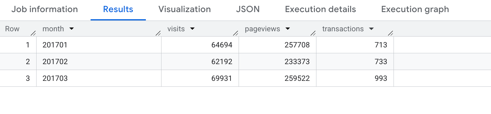
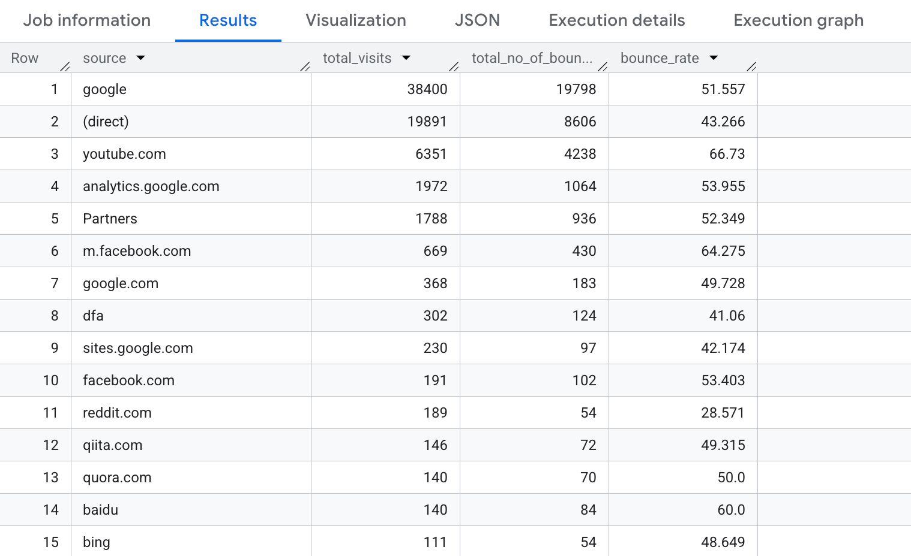
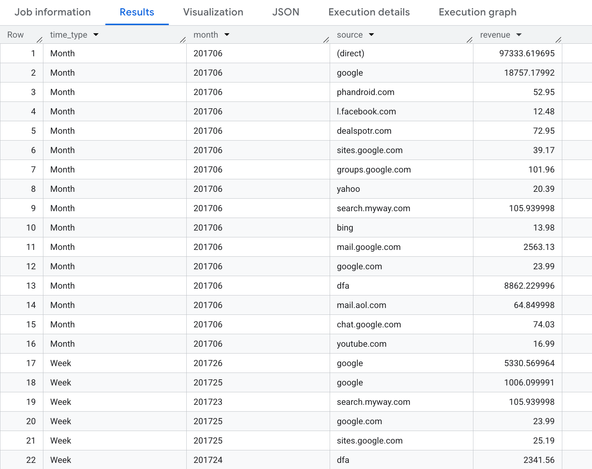
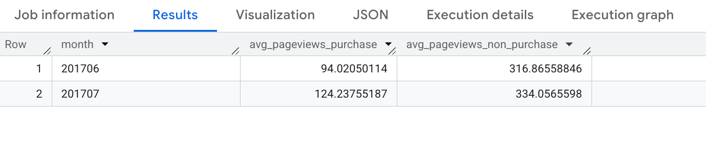
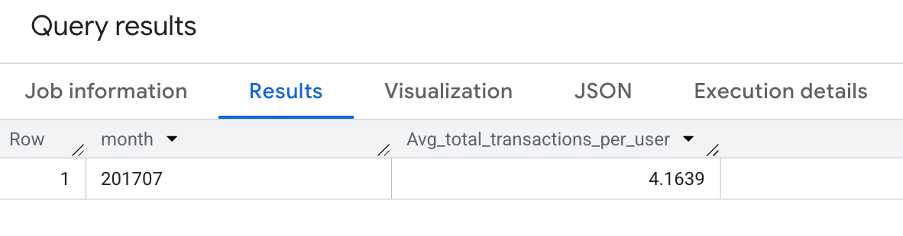
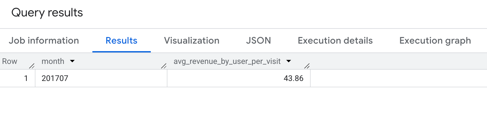
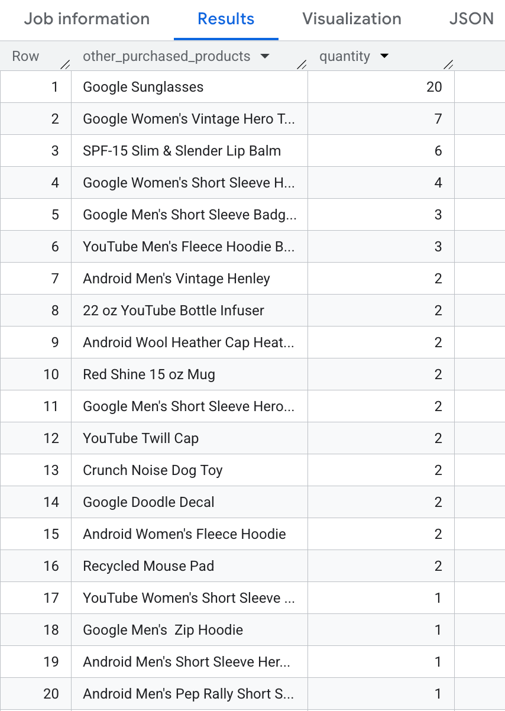
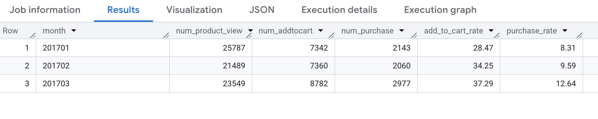

# Unlocking User Behavior: Google Analytics Session Analysis

> **Note:** This repository is intended for **technical readers** — data analysts, engineers, and technical leads. If you are looking for a business-focused overview of this project with visual insights, please visit the [Portfolio Page](https://hdangnguyen.github.io/projects/ga-session-analysis.html).


<br>

<div align="center">
  
</div>

---

## 1. Overview

The primary objective of this repository is to demonstrate advanced SQL capabilities in solving complex e-commerce business problems regarding **Conversion Funnel Analysis, User Segmentation, and Behavioral Analytics**.

### Table of Contents

- [1. Overview](#1-overview)
- [2. Dataset](#2-dataset)
- [3. Full Query Repository](#3-full-query-repository)
- [4. Project Structure](#4-project-structure)
- [5. Setup Instructions](#5-setup-instructions)

---

## 2. Dataset

This project is an end-to-end data analysis performed on **Google's public GA Sessions dataset** (`bigquery-public-data.google_analytics_sample.ga_sessions_2017*`). The dataset contains obfuscated web analytics data from the Google Merchandise Store, a real e-commerce website. 

**Understanding the BigQuery Data Structure:**
Working with raw Google Analytics data in BigQuery requires specific SQL syntax due to how the data is stored:
* **Table Wildcards (`*`)**: The data is sharded by day (e.g., `ga_sessions_20170101`). Using the asterisk `*` allows us to query across multiple days/months at once (e.g., `WHERE _table_suffix BETWEEN '0101' AND '0331'`).
* **Backticks (\`)**: In Google Standard SQL, table paths containing hyphens or special characters (like `bigquery-public-data...`) must be wrapped in backticks.
* **Complex Data Types (`UNNEST`)**: GA data heavily uses Arrays and Structs to keep data organized at the session level. A single row represents a multi-page session. To analyze individual page views (`hits`) or items carted (`product`), we must use the `UNNEST()` function to flatten these arrays into a tabular format before aggregating.

### Data Dictionary

To execute the 8 operational queries in this project, I utilized the core session schema. Below is a targeted data dictionary of the exact fields used in my analysis.

> 🔗 **Full Documentation:** For the complete explanation of all available fields in the GA export schema, please refer to the [Official Google Analytics BigQuery Export schema](https://support.google.com/analytics/answer/3437719?hl=en).

| Schema | Table / Struct | Columns Used in Queries | Business Purpose in Analysis |
| :--- | :--- | :--- | :--- |
| **Sessions** | `ga_sessions_2017*` | `fullVisitorId`, `date`, `totals` | Base structure for tracking unique users, cohorts, and aggregate timeline. |
| **Sessions** | `totals` | `visits`, `pageviews`, `transactions`, `bounces` | Fact metrics for calculating engagement, conversion events, and bounce rates. |
| **Sessions** | `trafficSource` | `source` | Analyzed to compare traffic quality and revenue performance across channels. |
| **Hits** | `hits` | `eCommerceAction` | Unnested to trace user steps through the product detail, cart, and checkout. |
| **Hits** | `eCommerceAction` | `action_type` | Filtered by '2' (View), '3' (Add to Cart), and '6' (Purchase) for the Funnel Analysis. |
| **Product** | `product` | `v2ProductName`, `productRevenue`, `productQuantity` | Unnested to identify top-selling items, compute revenue, and run cross-sell analysis. |

---

## 3. Full Query Repository

Below is the execution of all 8 operational queries. They are presented here with their logic and a sample of their output results so you can explore the insights directly.

<details>
<summary><b>Query 1: Monthly Traffic Overview</b> (Click to expand)</summary>

*Question: Calculate total visits, pageviews, and transactions for January, February, and March 2017.*

```sql
SELECT 
  FORMAT_DATE('%Y%m', PARSE_DATE('%Y%m%d', date)) AS month,
  COUNT(totals.visits)        AS visits,
  SUM(totals.pageviews)       AS pageviews,
  SUM(totals.transactions)    AS transactions
FROM `bigquery-public-data.google_analytics_sample.ga_sessions_2017*`
WHERE _table_suffix BETWEEN '0101' AND '0331'
GROUP BY month
ORDER BY month;
```
**Actual Output:**


</details>

<details>
<summary><b>Query 2: Bounce Rate by Traffic Source</b> (Click to expand)</summary>

*Question: Calculate the bounce rate per traffic source in July 2017.*

```sql
SELECT
  trafficSource.source                                            AS source,
  SUM(totals.visits)                                             AS total_visits,
  SUM(totals.bounces)                                            AS total_no_of_bounces,
  ROUND(SUM(totals.bounces) / SUM(totals.visits) * 100, 3)      AS bounce_rate
FROM `bigquery-public-data.google_analytics_sample.ga_sessions_201707*`
GROUP BY source
ORDER BY total_visits DESC;
```
**Actual Output:**


</details>

<details>
<summary><b>Query 3: Revenue by Traffic Source</b> (Click to expand)</summary>

*Question: Calculate revenue by traffic source by week and by month in June 2017.*

```sql
WITH
  month_data AS (
    SELECT
      'Month'                                                       AS time_type,
      FORMAT_DATE('%Y%m', PARSE_DATE('%Y%m%d', date))              AS time,
      trafficSource.source                                          AS source,
      ROUND(SUM(product.productRevenue) / 1000000, 4)              AS revenue
    FROM `bigquery-public-data.google_analytics_sample.ga_sessions_201706*`,
      UNNEST(hits)    AS hits,
      UNNEST(product) AS product
    WHERE product.productRevenue IS NOT NULL
    GROUP BY time_type, time, source
  ),

  week_data AS (
    SELECT
      'Week'                                                        AS time_type,
      FORMAT_DATE('%Y%W', PARSE_DATE('%Y%m%d', date))              AS time,
      trafficSource.source                                          AS source,
      ROUND(SUM(product.productRevenue) / 1000000, 4)              AS revenue
    FROM `bigquery-public-data.google_analytics_sample.ga_sessions_201706*`,
      UNNEST(hits)    AS hits,
      UNNEST(product) AS product
    WHERE product.productRevenue IS NOT NULL
    GROUP BY time_type, time, source
  )

SELECT * FROM month_data
UNION ALL
SELECT * FROM week_data
ORDER BY time_type, revenue DESC;
```
**Actual Output:**


</details>

<details>
<summary><b>Query 4: Avg Pageviews (Purchaser vs Non-Purchaser)</b> (Click to expand)</summary>

*Question: Calculate average number of pageviews by purchaser type (purchasers vs non-purchasers) in June and July 2017.*

```sql
WITH
  base AS (
    SELECT
      FORMAT_DATE('%Y%m', PARSE_DATE('%Y%m%d', date))  AS month,
      totals.transactions,
      product.productRevenue,
      totals.pageviews,
      fullVisitorId
    FROM `bigquery-public-data.google_analytics_sample.ga_sessions_2017*`,
      UNNEST(hits)    AS hits,
      UNNEST(product) AS product
    WHERE _table_suffix BETWEEN '0601' AND '0731'
  ),

  purchase AS (
    SELECT
      month,
      ROUND(SUM(pageviews) / COUNT(DISTINCT fullVisitorId), 8)  AS avg_pageviews_purchase
    FROM base
    WHERE transactions >= 1
      AND productRevenue IS NOT NULL
    GROUP BY month
  ),

  non_purchase AS (
    SELECT
      month,
      ROUND(SUM(pageviews) / COUNT(DISTINCT fullVisitorId), 8)  AS avg_pageviews_non_purchase
    FROM base
    WHERE transactions IS NULL
      AND productRevenue IS NULL
    GROUP BY month
  )

SELECT *
FROM purchase
FULL JOIN non_purchase USING (month)
ORDER BY month;
```
**Actual Output:**


</details>

<details>
<summary><b>Query 5: Avg Transactions per User</b> (Click to expand)</summary>

*Question: Calculate the average number of transactions per user that made a purchase in July 2017.*

```sql
SELECT
  FORMAT_DATE('%Y%m', PARSE_DATE('%Y%m%d', date))                        AS month,
  ROUND(SUM(totals.transactions) / COUNT(DISTINCT fullVisitorId), 4)     AS avg_total_transactions_per_user
FROM `bigquery-public-data.google_analytics_sample.ga_sessions_201707*`,
  UNNEST(hits)    AS hits,
  UNNEST(product) AS product
WHERE totals.transactions >= 1
  AND product.productRevenue IS NOT NULL
GROUP BY month;
```
**Actual Output:**


</details>

<details>
<summary><b>Query 6: Avg Revenue per Session</b> (Click to expand)</summary>

*Question: Calculate the average amount of money spent per session (purchasers only) in July 2017.*

```sql
SELECT
  FORMAT_DATE('%Y%m', PARSE_DATE('%Y%m%d', date))                          AS month,
  ROUND((SUM(product.productRevenue) / SUM(totals.visits)) / 1000000, 2)  AS avg_revenue_by_user_per_visit
FROM `bigquery-public-data.google_analytics_sample.ga_sessions_201707*`,
  UNNEST(hits)    AS hits,
  UNNEST(product) AS product
WHERE totals.transactions >= 1
  AND product.productRevenue IS NOT NULL
GROUP BY month;
```
**Actual Output:**


</details>

<details>
<summary><b>Query 7: Cross-sell Analysis (Market Basket)</b> (Click to expand)</summary>

*Question: Calculate other products purchased by customers who also bought "YouTube Men's Vintage Henley" in July 2017.*

```sql
WITH
  buyer_list AS (
    SELECT DISTINCT fullVisitorId
    FROM `bigquery-public-data.google_analytics_sample.ga_sessions_201707*`,
      UNNEST(hits)    AS hits,
      UNNEST(product) AS product
    WHERE product.v2ProductName = "YouTube Men's Vintage Henley"
      AND totals.transactions >= 1
      AND product.productRevenue IS NOT NULL
  )

SELECT
  product.v2ProductName           AS other_purchased_products,
  SUM(product.productQuantity)    AS quantity
FROM `bigquery-public-data.google_analytics_sample.ga_sessions_201707*`,
  UNNEST(hits)    AS hits,
  UNNEST(product) AS product
JOIN buyer_list USING (fullVisitorId)
WHERE product.v2ProductName != "YouTube Men's Vintage Henley"
  AND product.productRevenue IS NOT NULL
  AND totals.transactions >= 1
GROUP BY other_purchased_products
ORDER BY quantity DESC;
```
**Actual Output:**


</details>

<details>
<summary><b>Query 8: E-Commerce Conversion Funnel</b> (Click to expand)</summary>

*Question: Generate a cohort map of the checkout funnel (Product View → Add to Cart → Purchase) for Jan–Mar 2017.*

```sql
WITH
  data_overview AS (
    SELECT
      FORMAT_DATE('%Y%m', PARSE_DATE('%Y%m%d', date))  AS month,
      eCommerceAction.action_type                       AS action_type,
      totals.transactions,
      product.productRevenue
    FROM `bigquery-public-data.google_analytics_sample.ga_sessions_2017*`,
      UNNEST(hits)    AS hits,
      UNNEST(product) AS product
    WHERE _table_suffix BETWEEN '0101' AND '0331'
  ),

  data_count AS (
    SELECT
      month,
      COUNTIF(action_type = '2')                                  AS num_product_view,
      COUNTIF(action_type = '3')                                  AS num_addtocart,
      COUNTIF(action_type = '6' AND productRevenue IS NOT NULL)   AS num_purchase
    FROM data_overview
    GROUP BY month
    ORDER BY month
  )

SELECT
  *,
  ROUND(num_addtocart / num_product_view * 100.0, 2)  AS add_to_cart_rate,
  ROUND(num_purchase  / num_product_view * 100.0, 2)  AS purchase_rate
FROM data_count;
```
**Actual Output:**


</details>

---

## 4. Project Structure

```text
├── documents/
│   ├── q1.png        # Execution results for Q1
│   ├── q2.png        # Execution results for Q2
│   ├── q3.png        # Execution results for Q3
│   ├── q4.png        # Execution results for Q4
│   ├── q5.png        # Execution results for Q5
│   ├── q6.png        # Execution results for Q6
│   ├── q7.png        # Execution results for Q7
│   └── q8.png        # Execution results for Q8
├── query/
│   ├── q01_monthly_traffic_overview.sql
│   ├── q02_bounce_rate_by_source.sql
│   ├── q03_revenue_by_source_week_month.sql
│   ├── q04_avg_pageviews_by_purchaser_type.sql
│   ├── q05_avg_transactions_per_user.sql
│   ├── q06_avg_revenue_per_session.sql
│   ├── q07_cross_sell_products.sql
│   └── q08_conversion_funnel_cohort.sql
└── README.md
```

---

## 5. Setup Instructions

To execute these queries yourself on Google BigQuery:

1. Open the [Google Cloud Console - BigQuery](https://console.cloud.google.com/bigquery).
2. Create a new Google Cloud Project if you don't already have one.
3. In the query editor, you can directly copy-paste the queries from this repository.
4. The dataset `bigquery-public-data.google_analytics_sample.ga_sessions_2017*` is publicly available to all GCP users.
